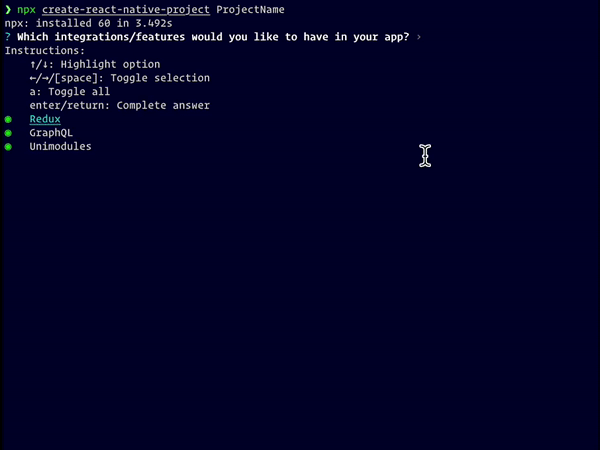

# create-react-native-project

Project generator from react-native init template and preconfigured options. <br>
Drop in replacement for `react-native init`

# Usage:

```sh
npx create-react-native-project ProjectName
```

# Example



# Features

### Legend

| Meaning                   | Status             |
| ------------------------- | ------------------ |
| Done                      | :white_check_mark: |
| Work in progress          | :construction:     |
| To be added               | :hourglass:        |
| Idea (might not be added) | :thinking:         |

<br>

| Integrations      | Status             | Description                          |
| ----------------- | ------------------ | ------------------------------------ |
| Fastlane          | :hourglass:        |
| GraphQL           | :white_check_mark: | @apollo/client + setup               |
| Redux             | :white_check_mark: | react-redux + @redux/toolkit + setup |
| Unimodules        | :white_check_mark: | react-native-unimodules + setup      |
| Sentry            | :hourglass:        |
| Detox             | :hourglass:        |
| Firebase          | :thinking:         |
| PushNotifications | :thinking:         | i.e. Notifee                         |

| Modules                       | Status             | Description           |
| ----------------------------- | ------------------ | --------------------- |
| react-native-config           | :hourglass:        |
| react-native-gesture-handler  | :white_check_mark: |
| react-native-keyboard-manager | :thinking:         |
| react-native-reanimated       | :white_check_mark: | + react-native-redash |
| react-native-screens          | :white_check_mark: |
| react-navigation              | :hourglass:        |
| react-native-vector-icons     | :white_check_mark: |
| react-native-svg              | :white_check_mark: |

# Default configuration

| Feature                                                       | Status             |
| ------------------------------------------------------------- | ------------------ |
| [ESLint](./templates/common/$.eslint.js)                      | :white_check_mark: |
| [Husky](https://github.com/typicode/husky)                    | :white_check_mark: |
| [I18n](https://github.com/i18next/react-i18next)              | :white_check_mark: |
| [LintStaged](https://github.com/okonet/lint-staged)           | :white_check_mark: |
| [ProGuard](./templates/common/android/app/proguard-rules.pro) | :white_check_mark: |
| [TypeScript](./templates/common/tsconfig.json)                | :white_check_mark: |

# Additionals

Heavily inspired by :heart: [react-native-builder-bob](https://github.com/callstack/react-native-builder-bob)
